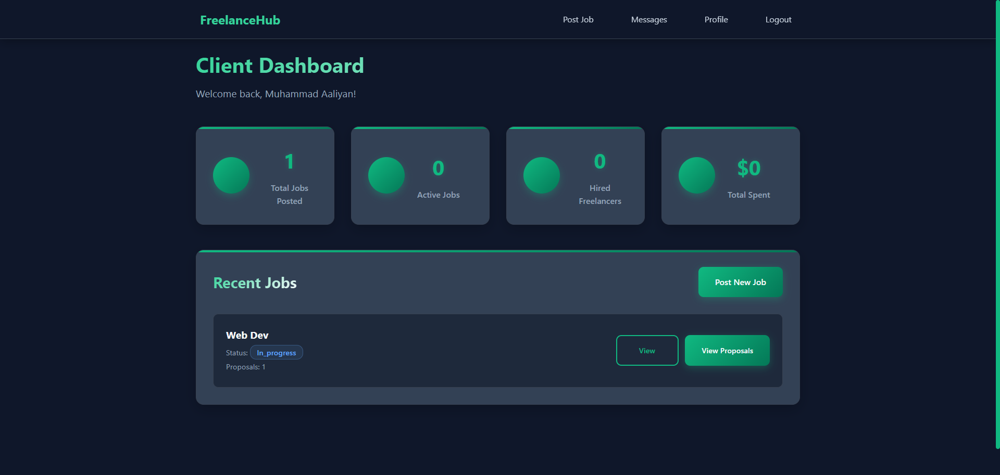
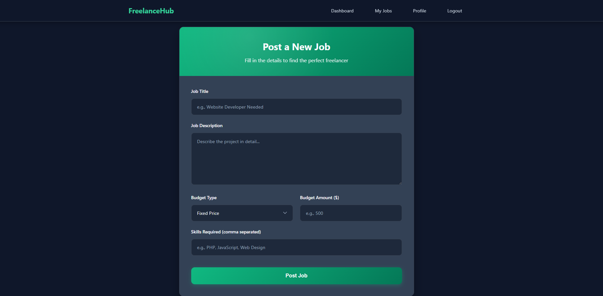
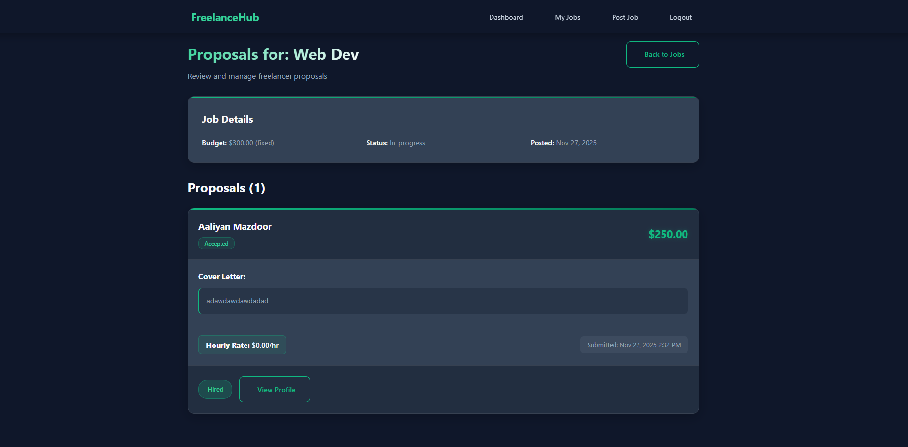
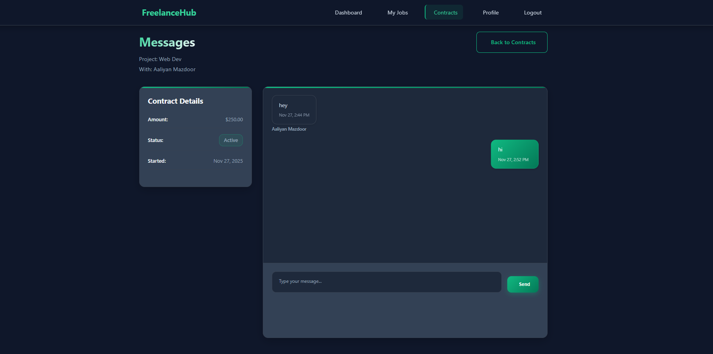

# 🌿 Mini Upwork — Freelancing Marketplace (PHP + MySQL)

A mini Upwork-style freelancing platform built with PHP and MySQL.  
Clients post jobs, review proposals, hire freelancers, and manage projects.  
Freelancers browse work, submit bids, message clients, and track contracts.  
The system includes authentication, user profiles, messaging, payments, and reviews — everything stitched together like a classic, handcrafted web app.

---

## ✨ Main Features

### 🔐 Authentication & User Roles
- Client & Freelancer account types  
- Secure registration and login  
- Password hashing & session-based authentication  
- Individual profile pages  

### 📝 Job Management (Client Side)
- Post jobs with title, budget, timeline, and description  
- View and manage posted jobs  
- Review proposals submitted by freelancers  
- Accept or reject proposals  
- Mark projects as completed  

### 📨 Proposal System (Freelancer Side)
- Browse all open jobs  
- Search and filter listings  
- Submit proposals with custom bid + cover letter  
- Track proposal status (pending / accepted / rejected)  

### 🤝 Hiring & Contracts
- Contract created when a proposal is accepted  
- Stores terms, timeline, and job details  
- Automatically updates job status (open → in progress → completed)  

### 💬 Messaging System
- One-to-one chat between client and hired freelancer  
- Messages linked to the project/contract  
- Simple, clean communication flow  

### 💸 Payment Tracking
- Track milestone payments  
- Mark payments as completed  
- Update project status after payment confirmation  

### ⭐ Ratings & Reviews
- Both client and freelancer can leave feedback  
- Star ratings + text review  
- Display average rating on user profile  

---

## 📸 Screenshots

*(Place your screenshots inside a folder named `ss/` and update the filenames if needed.)*

### 🔹 Dashboard


### 🔹 Job Posting Page


### 🔹 Proposals Page


### 🔹 Messaging Page


---

## ⚙️ Installation

1. Clone the repository:  
   ```bash
   git clone https://github.com/AaliyanUstad/mini-upwork.git
